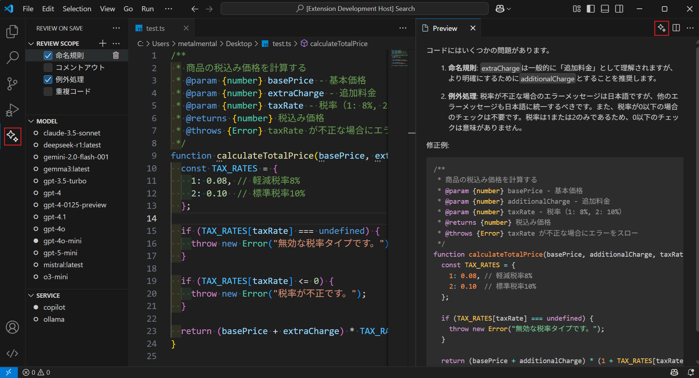

# review-on-save README

In Development...

VSCode extension that performs code review using Ollama on file save

> ⚠️ **Important**: To use Ollama, you need to install Ollama in advance from [Ollama](https://ollama.com/download)
